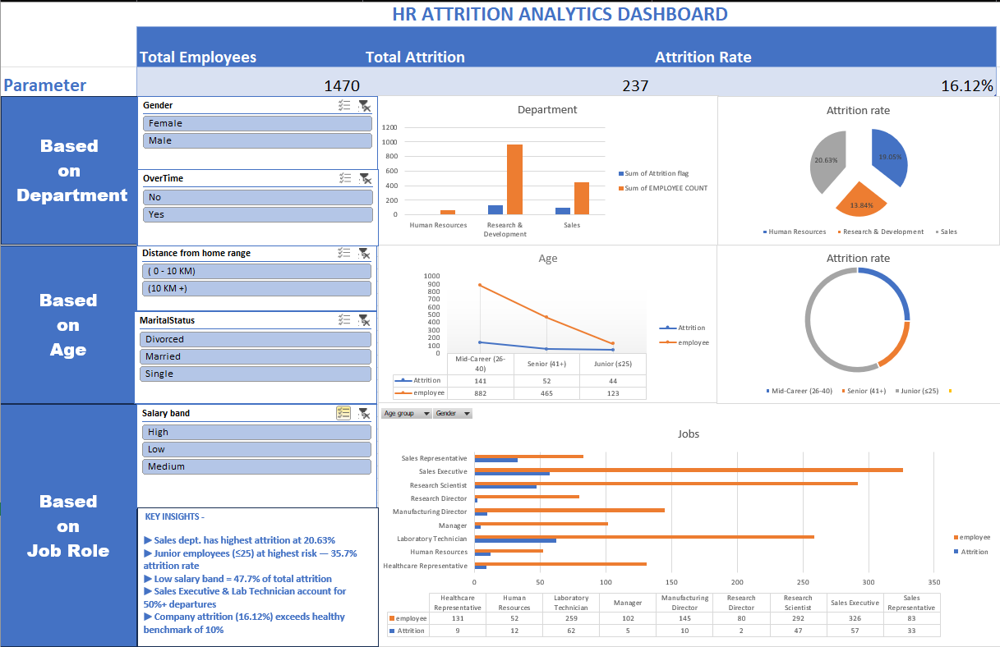

# 📊 Excel Projects Portfolio

Interactive data analytics and business intelligence projects built using Microsoft Excel, focusing on dashboard design, KPI tracking, and business insights.

---

# 🏢 HR Attrition Analytics Dashboard

## 📷 Dashboard Preview


---

## 🎯 Business Objective

Identify patterns contributing to employee attrition and generate insights that can help HR teams improve employee retention strategies.

---

## 🛠 Tools & Technologies

- Microsoft Excel
- Pivot Tables
- Pivot Charts
- Interactive Slicers
- Conditional Formatting
- KPI Cards
- Data Visualization Techniques

---

## 🛠 Skills Demonstrated

- Data Cleaning
- Data Transformation
- Dashboard Design
- KPI Reporting
- Data Visualization
- Business Insights Generation
- Interactive Dashboard Development
- Analytical Thinking

---

## 📂 Dataset Information

**Dataset:** IBM HR Analytics Employee Attrition & Performance (Kaggle)  
**Records:** 1,470 Employees × 35 Attributes

---

# 🔧 Project Workflow

## Phase 1 — Data Cleaning & Transformation

- Removed redundant columns:
  - EmployeeCount
  - Over18
  - StandardHours

- Removed synthetic/randomized columns:
  - DailyRate
  - HourlyRate
  - MonthlyRate

- Created custom analytical columns:
  - **Age Group** → Junior / Mid-Career / Senior
  - **Salary Band** → Low / Medium / High
  - **Distance Range** → 0–10 KM / 10 KM+
  - **Attrition Flag** → Yes = 1 / No = 0

---

## Phase 2 — Data Analysis

Developed Pivot Tables to analyze employee attrition trends across:

- Department
- Age Group
- Job Role
- Salary Band
- Overtime Status

Calculated attrition rates for each segment to identify high-risk employee groups.

---

## Phase 3 — Dashboard Development

Built an interactive HR Analytics Dashboard featuring:

### KPI Cards
- Total Employees
- Total Attrition
- Attrition Rate

### Interactive Features
- Gender Filter
- Overtime Filter
- Distance Range Filter
- Marital Status Filter
- Salary Band Filter

### Dashboard Visualizations
- Department-wise Attrition Analysis
- Age Group Attrition Trends
- Job Role Attrition Comparison
- Salary Band Attrition Analysis

### Additional Features
- Dynamic filtering using slicers
- Connected slicers across all charts
- Business insights section
- Interactive exploration capability

---

# 📊 Key Business Insights

- Sales department has the highest attrition rate at **20.63%**
- Junior employees (≤25 years) are at highest risk with **35.7% attrition**
- Low salary band contributes **47.7%** of total attrition
- Sales Executive and Laboratory Technician roles account for **50%+** of employee departures
- Overall company attrition rate of **16.12%** exceeds the healthy industry benchmark of **10%**

---

# 🚀 Future Improvements

- SQL-based data storage and querying
- Power BI dashboard version
- Advanced KPI tracking
- Predictive attrition analysis
- Automated reporting workflows

---

# 📁 Project Structure

```text
HR-Attrition-Analytics/
│
├── Dataset/
├── Dashboard Screenshot/
├── Excel Dashboard/
└── README.md
```

---

# ✅ Project Outcome

This project demonstrates foundational skills in:
- Data analytics
- Dashboard development
- Business intelligence reporting
- Interactive visualization
- Insight generation using Microsoft Excel

It also serves as the foundation for future SQL and Power BI analytics projects.
